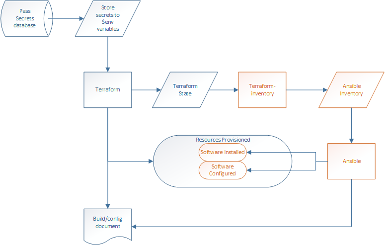

# Project Description

This project will provision and configure a Citrix Virtual Apps & Desktops environment to vSphere.  Terraform will be used to provision the VM resources and join the VMs to the domain.  Ansible will be used to install and confiugre software components on the provisioned VMs.

Process Workflow: \

## Pre-requisites
- A Windows Server 2019 VM template in vSphere
- An Active Directory account with permissions to join a computer to the domain
- An Active Directory account with standard Domain Users permissions
- A SMB or CIFS share with the Citrix Virtual Apps & Desktops and SQL extracted installation media

## Inventory
- 1 SQL / Cirix Licensing server
- 2 Delivery Controller / Director servers
- 2 StoreFront servers
- 1 RDSH VDA

### Credits
A lot of the code was sourced from here and modified to meet my goals: \
https://github.com/ryancbutler/Citrix-VAD-LAB
