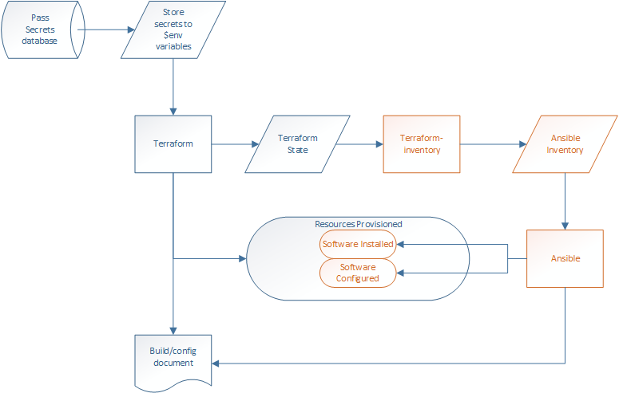

# Project Description
This example project will use Terraform to provision a VM to on-prem vSphere, rename it, and join it to the domain.

## Project workflow
This project only uses Terraform, but a full Infrastructure as Code (IaC) solution would include the Ansible process flow.


## Pre-requisites
- A Windows Server 2019 template in vSphere
- An Active Directory account with domain join permissions

## Inventory
- 1 VM named sql01

## Build.sh breakdown
Script process flow
- Create a document stub that we will append to as things are created
- Query the pass database.  You will be prompted for the master password and the database will remain open for 10min
- Store usernames and passwords needed for this Terraform project into memory resident variables
- `terraform init` - Terraform reads all the .tf files to identify needed plugins and modules and downloads them to the current project directory.
- `terraform plan --var-file="<variable file>"` - Terraform outputs what it is going to do based on all the project files, but doesn't execute the project. `-out=path` will save the output to a file.
- `terraform apply --var-file="<variable file>"` - Terraform will execute the plan. Insert `--auto-approve` if you do not want to be prompted for confirmation.

## Destroy.sh breakdown
Script process flow
- Query the pass database.  You will be prompted for the master password and the database will remain open for 10min
- Store usernames and passwords needed for this Terraform project into memory resident variables
- `terraform destroy --var-file="<variable file>"` - Terraform destroys everything in the plan.  This is equivalent to powering off the VMs, deleting them from disk in vSphere, and deleting the VM folder.  A future version should run an Ansible playbook to clean up AD accounts.
 
---
#### Take a look at the files in the [Terraform](https://github.com/Burwood/JLH_Automation/tree/master/Example_Project/terraform) directory to learn more.  Each has comments to help you understand what is going on.
---

# Next steps

## Configure a template VM
Create a Windows Server 2019 VM and install VMware tools if needed

### Configure WinRM for future projects with Ansible
NOTE: If you are using an older OS for your template, please refer to this guide for installing WinRM: https://docs.ansible.com/ansible/2.5/user_guide/windows_setup.html

```powershell
$url = "https://raw.githubusercontent.com/ansible/ansible/devel/examples/scripts/ConfigureRemotingForAnsible.ps1"
$file = "$env:temp\ConfigureRemotingForAnsible.ps1"
(New-Object -TypeName System.Net.WebClient).DownloadFile($url, $file)
powershell.exe -ExecutionPolicy ByPass -File $file
``` 

### Create a VM snapshot
This project expects there to be one snapshot on the template VM so we can leverage linked-clones

## Populate secrets in pass
We will create all our project secrets and a dummy secret "testuser".  Avoid "-" in the secret name, as Ansible doesn't like that character in a variable. The first time you query the pass database, it will prompt you for your master password.  We will use the testuser secret to query the pass database before running the scripts.

Run these one at a time, as each will prompt for the value of that secret. 

```bash
pass insert testuser
pass insert vsphere_user
pass insert vsphere_pass                       
pass insert domain_user
pass insert domain_pass
```

## Copy the repo locally
Open the Ubuntu console and run the following commands to copy the example project files to ~/test/Example_Project
```bash
git clone https://github.com/Burwood/JLH_Automation --no-checkout test
cd test
git sparse-checkout init --cone
git sparse-checkout set Example_Project
```


### Update the variable files to match your environment
You can do this in Windows using one of the editors recommended on the top-level page, or via a Linux text editor such as nano, vi, or emacs.

NOTE: If we create new files in Ubuntu from Windows, Ubuntu doesn't see them properly.  However, once a file exists in Ubuntu, you can edit it within Windows! You can access the Ubuntu file structure from a path similar to this: 

`C:\Users\jheistand\AppData\Local\Packages\CanonicalGroupLimited.Ubuntu20.04onWindows_79rhkp1fndgsc\LocalState\rootfs\`

Or if you need to go the other way, and see the Windows file system in Ubuntu, here is the path:

`/mnt/c/`

```bash
nano ~/Example_Project/Terraform/values.tfvars
```

### Run the build.sh script
```bash
cd ~/Example_Project/
./build.sh
```

## Check out the auto-created document
The file `builddoc.md` will be generated during the build.  If you downloaded Visual Studio Code, it will recognize markdown format.  Open it with VSS and click on the preview button in the top right.  It looks like two rectangles and a magnifying glass.

---

# Did it work???
Please let me know of any steps you had to figure out, or were incorrect. \
For the next challenge, check out this next project that adds in Ansible: [Citrix On-Prem](https://github.com/Burwood/JLH_Automation/tree/master/Citrix%20On-Prem)

## References I used to create this project
https://www.terraform.io/docs/commands \
https://github.com/adammck/terraform-inventory \
https://www.passwordstore.org/ \
https://git.zx2c4.com/password-store/about/

